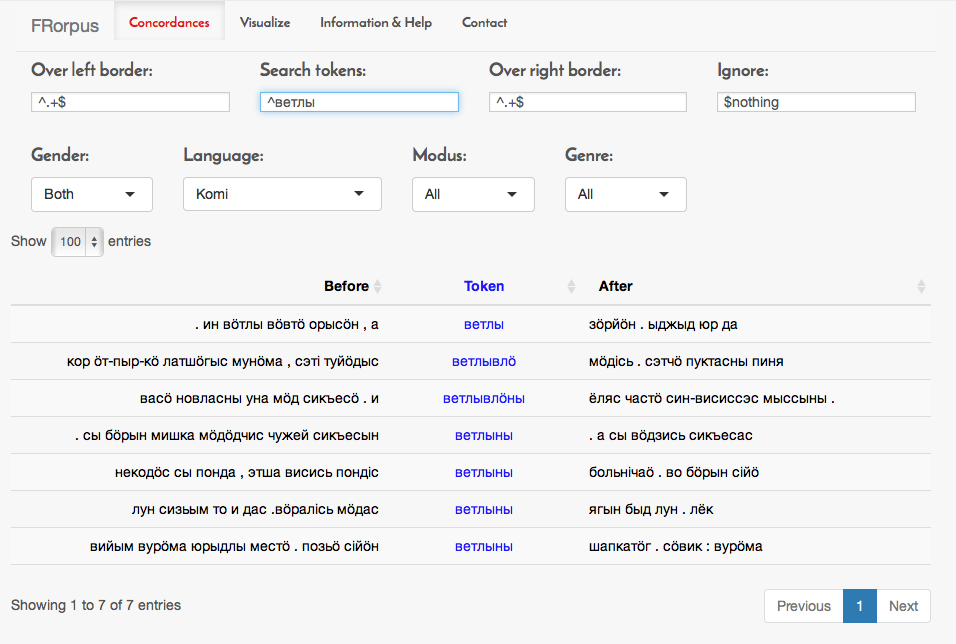

# FRorpus demo version

FRorpus is a corpus interface developed in Freiburg Research Group in Saami Studies. It works directly with R package [FRelan](github.com/izvakomi/FRelan), which which parses the ELAN files into format that is suitable for corpus searches.

The most relevant aspect of FRorpus is the ease of integrating metadata into the searches. The data frame produced by FRelans `read_eaf()` function contains both the session name and the speaker id. These can be associated with any relevant combinations of metadata.

In this demo the token data is real, but the metadata is generated in the `helper_function.R script`.

The application is running [online](langdoc.shinyapps.io/FRorpus-demo). However, due to restrictions of Shinyapps.io free account, it is very possible that it doesn't run after maximum usage per month has been reached. Thereby it is advisable to run it at home.

Instead of using app online it is possible to run it locally with the following command:

    shiny::runGitHub('FRorpus-demo', 'langdoc')

This can be done from Terminal with commands:

    R
    install.packages("shiny")
    library(shiny)
    shiny::runGitHub('FRorpus-demo', 'langdoc')

This opens the application in your default web browser. You can close it with `ctrl+c`.

## FRelan

FRorpus works primarily in connection with R package FRelan. It can be installed with command:

    install.packages("devtools")
    devtools::install_github("langdoc/FRelan")

It exists also as a built in function within FRelan. As an example, it is possible to parse ELAN files into a corpus, and to open this data in FRorpus locally.

    library(FRelan)
    library(dplyr)
    corpus <- read_eaf(".")
    corpus %>% FRorpus()

Please see FRelan documentation for further information.
